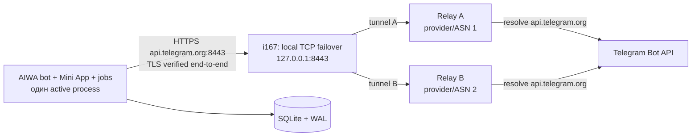
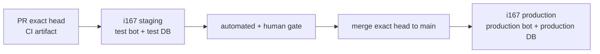

# AIWA: план полной миграции production на i167

Статус: план, без переключения production.
Дата аудита: 2026-07-30, `Europe/Moscow`.
Исключено из этого плана: PostgreSQL, Redis и `Railway roles`; ветка
`origin/codex/railway-roles-tracing` не используется и не объединяется.

## Решение в одном абзаце

Production-приложение, Mini App, SQLite, фоновые задачи и генераторы переносим
на i167 как один активный экземпляр. Telegram-трафик не выпускаем напрямую с
российского IP и не привязываем к IP Telegram: на i167 работают два независимых
TLS-прозрачных туннеля через два зарубежных relay у разных провайдеров/ASN, а
локальный TCP-balancer выбирает здоровый путь. Бот продолжает обращаться к
`api.telegram.org`, проверяет официальный TLS-сертификат и хранит токен только
на i167. На переходный период Railway сохраняется выключенной точкой отката.

Это наиболее короткий путь к полной миграции без разделения текущего монолита.
Долгосрочно bot-edge можно отделить от AIWA core через долговечную очередь, но
это уже отдельное архитектурное изменение и не должно блокировать перенос.

## 1. Что проверено сейчас

### Production и staging

- production работает одной репликой на Railway;
- staging работает на i167 как `aiwa-staging.service`;
- прежний Railway staging отключён 2026-07-30: у
  `worker-staging` (`9633f3f3-380a-44f5-97b8-f74b9429f33e`) нет активного
  deployment, регионов и реплик; deployment
  `9e8cf587-e496-42b6-b862-30d8763e2ece` имеет статус `REMOVED`;
- Railway staging volume `worker-staging-volume`
  (`44b1a982-bb8a-40e0-93cf-4aedc9bd6205`, около 1.14 ГБ) пока сохранён только
  для контролируемого backup/restore; это всё ещё платное хранение и не является
  финальным закрытием среды;
- код staging разворачивается в неизменяемые
  `/srv/aiwa-staging/releases/<git-sha>` и включается атомарным symlink;
- SQLite, секреты и статические файлы отделены от release;
- Caddy читает только из отдельного public-release;
- production использует Telegram long polling;
- одновременно запускать Railway и i167 с одним `BOT_TOKEN` нельзя.

### Telegram-связность i167

Read-only smoke от 2026-07-30:

| Путь | Результат |
|---|---|
| i167 → `api.telegram.org:443`, IPv4 | соединение не устанавливается |
| i167 → `api.telegram.org:443`, IPv6 | соединение не устанавливается |
| i167 → `127.0.0.1:8443` → relay → Telegram | TLS и HTTP проходят |

Текущий relay:

- i167 unit: `gigatool-tg-tunnel.service`;
- relay: `hetz2`, Германия, `167.233.64.107`;
- local forward:
  `127.0.0.1:8443 → api.telegram.org:443`;
- SSH keepalive: 30 секунд, три пропуска;
- `StrictHostKeyChecking=yes`;
- relay-ключ имеет `restrict`, `port-forwarding` и
  `permitopen="api.telegram.org:443"`;
- пользователь relay имеет shell `nologin`;
- приложение подключается к публичному имени `api.telegram.org` и проверяет
  публичную цепочку TLS.

Текущая схема не раскрывает bot token relay-серверу, но relay один и поэтому
является единой точкой отказа.

## 2. Почему обычный NAT Yandex Cloud не решает задачу

NAT Gateway или NAT instance меняет адрес выхода, но адрес всё равно остаётся
в российском облачном контуре. Это полезно для изоляции i167 и общего egress,
но не устраняет географическую недоступность Telegram.

Yandex Cloud позволяет:

- направлять `0.0.0.0/0` через NAT Gateway;
- указывать VM как `next hop`;
- автоматически переключать маршрут между двумя NAT VM.

Эти возможности стоит использовать для общей сетевой отказоустойчивости, но
Telegram должен иметь дополнительный зарубежный транспорт.

Источники:

- [Yandex Cloud: NAT Gateway](https://yandex.cloud/en/docs/vpc/concepts/gateways)
- [Yandex Cloud: static routes](https://yandex.cloud/en/docs/vpc/operations/static-route-create)
- [Yandex Cloud: fault-tolerant NAT VMs](https://yandex.cloud/en/docs/tutorials/routing/route-switcher)

## 3. Варианты Telegram-архитектуры

### Вариант A — два прозрачных relay, приложение целиком на i167

**Рекомендуемый первый production-вариант.**



Реализация:

1. Существующий relay оставить как A.
2. Relay B создать у другого провайдера и желательно в другой стране/ASN.
   Конкретного поставщика выбирают по доступности аккаунта, оплате и договору;
   критично не размещать оба relay в Hetzner или одном дата-центре.
3. Два systemd-туннеля слушают разные loopback-порты, например `18443` и
   `28443`.
4. HAProxy в `mode tcp` слушает `127.0.0.1:8443`, проверяет оба backend
   полноценным TLS handshake с SNI `api.telegram.org` и системным CA bundle.
5. Приложение сохраняет:
   - `AIWA_TELEGRAM_API_ORIGIN=https://api.telegram.org:8443`;
   - `AIWA_TELEGRAM_BOT_BASE_URL=https://api.telegram.org:8443/bot`;
   - `AIWA_TELEGRAM_FILE_BASE_URL=https://api.telegram.org:8443/file/bot`.
6. Service-specific hosts file направляет только `api.telegram.org` на
   `127.0.0.1`; системный `/etc/hosts` не меняется.
7. При отказе A новые TCP-соединения идут через B. Long polling получает
   транспортную ошибку и переподключается; второй процесс AIWA не запускается.

Плюсы:

- минимальные изменения приложения;
- relay не видит токен и health data внутри TLS;
- нет IP Telegram в конфигурации;
- failover не требует релиза AIWA;
- легко проверить и откатить.

Минусы:

- два маленьких внешних VPS всё равно нужно эксплуатировать;
- переключение обрывает текущий long-poll, поэтому возможна короткая пауза;
- SSH-control path и HAProxy становятся частью обязательного мониторинга.

### Вариант B — временно оставить bot-edge на Railway

Railway принимает update и отправляет сообщения, а core/API/Mini App живут на
i167. Это лучший переходный вариант, если важнее минимальный риск в день
миграции, чем немедленное удаление Railway.

Плюсы:

- Telegram egress остаётся проверенным;
- откат bot-edge почти мгновенный;
- российская сеть не влияет на polling.

Минусы:

- текущий AIWA — монолит, его нужно разделить;
- нужен аутентифицированный внутренний протокол и долговечная очередь;
- нельзя делать это на transient HTTP-вызовах без idempotency;
- до появления очереди легко получить потерю/дубли updates.

Рекомендация: использовать только как отдельный последующий проект либо
аварийный fallback, не как скрытую часть текущего переноса.

### Вариант C — внешний webhook-edge

Telegram отправляет webhook на зарубежный edge; edge записывает update в
очередь и передаёт его i167. Ответы Telegram также проходят через edge.

Telegram официально считает `getUpdates` и webhook взаимоисключающими; update
хранится на стороне Telegram не более 24 часов. Webhook поддерживает секретный
заголовок `X-Telegram-Bot-Api-Secret-Token`.

Плюсы:

- Telegram не должен соединяться с российским публичным IP;
- можно масштабировать ingress отдельно;
- удобнее дедуплицировать по `update_id`.

Минусы:

- без долговечной очереди edge сам становится точкой потери;
- это заметное изменение delivery semantics;
- нужен отдельный sender/dispatcher и строгая idempotency;
- текущая SQLite остаётся одним writer и ограничивает active-active.

Источник:
[Telegram Bot API: receiving updates](https://core.telegram.org/bots/api#getting-updates).

### Вариант D — официальный локальный Bot API server вне России

Telegram публикует официальный
[`telegram-bot-api`](https://github.com/tdlib/telegram-bot-api), но для
миграции AIWA это не лучший первый выбор:

- для перехода с cloud Bot API нужно вызвать `logOut`;
- одновременный login на нескольких local servers не гарантирует получение
  всех updates;
- при переносе между local servers требуется корректно закрывать инстанс и
  переносить его рабочее состояние;
- появляется stateful-компонент, `api_id`/`api_hash`, обновления и дисковое
  состояние;
- основная выгода local mode — большие файлы и дополнительные локальные
  возможности, а не автоматическая HA.

Его стоит выбирать только если AIWA действительно нужны local-mode функции.
Для обычного текста, voice/photo и PDF прозрачные relay проще и надёжнее.

### Вариант E — hardcoded Telegram IP

**Запрещён как production-решение.**

IP Telegram может измениться, IPv4/IPv6 могут вести себя по-разному, а
сертификат всё равно требует правильного имени. Хардкод усложняет ротацию и
может незаметно превратить временный обход в необслуживаемую зависимость.

## 4. Требования к relay A и B

Каждый relay:

- отдельный минимальный VPS без приложений и пользовательских данных;
- другой провайдер/ASN относительно второго relay;
- только SSH с ключами, без паролей;
- отдельный `tgrelay` с `nologin`;
- authorized key:
  `restrict,port-forwarding,permitopen="api.telegram.org:443",command="/bin/false"`;
- firewall разрешает SSH только с i167 и аварийного operator IP/VPN;
- `GatewayPorts=no`;
- без agent/X11/TTY forwarding;
- автоматические security updates или фиксированное еженедельное окно;
- disk/log limits;
- node exporter или минимальный signed heartbeat;
- DNS-resolve и TLS-smoke к `api.telegram.org` каждые 30–60 секунд;
- отсутствие bot token, SQLite, пользовательских сообщений и provider keys.

Для туннеля:

- `ExitOnForwardFailure=yes`;
- `ServerAliveInterval=30`;
- `ServerAliveCountMax=3`;
- `StrictHostKeyChecking=yes`;
- отдельный pinned `known_hosts`;
- `Restart=always`, ограничение restart burst;
- отдельный ключ на каждый relay;
- `MemoryMax`, `TasksMax`, `NoNewPrivileges`.

WireGuard — допустимая альтернатива SSH. Он удобен, если через relay пойдёт
несколько разрешённых upstream, но требует policy routing и firewall. Для
единственного `api.telegram.org:443` SSH `permitopen` даёт более узкий и
проверяемый capability. WireGuard `PersistentKeepalive` поддерживается
официально, но сам по себе не даёт application-level health check:
[WireGuard Quick Start](https://www.wireguard.com/quickstart/).

## 5. Мониторинг Telegram-пути

### Обязательные метрики

- `telegram_relay_up{relay="a|b"}` — TLS handshake с правильным SNI/CA;
- активный relay;
- число переключений и время последнего переключения;
- `telegram_poll_last_success_timestamp`;
- `telegram_api_requests_total{method,status_class}`;
- timeouts/connect/TLS errors;
- `telegram_updates_last_id` и lag;
- `getUpdates Conflict` — всегда авария;
- очередь исходящих сообщений и возраст старейшего элемента;
- NRestarts AIWA, tunnel A/B и HAProxy.

### Readiness

`/health` не должен становиться `500` из-за краткого отказа одного relay, если
второй жив. Рекомендуемые состояния:

- `ready`: приложение, SQLite writer и хотя бы один Telegram path здоровы;
- `degraded`: приложение живо, оба Telegram path временно недоступны;
- `not_ready`: SQLite writer/миграция/приложение не готовы.

Публичный health не раскрывает IP relay, токен или provider errors. Детали
видны только во внутреннем metrics endpoint.

### Synthetic probe

`getMe` подтверждает Bot API end-to-end, но не нужно делать его на каждый
HTTP health request. Один внутренний probe раз в 30–60 секунд с jitter,
deduplication и небольшим timeout достаточно. Отдельно контролируется свежесть
успешного long poll.

## 6. Production layout на i167

```text
/srv/aiwa/
  releases/<full-git-sha>/          # immutable source
  current -> releases/<sha>         # atomic symlink
  public-releases/<full-git-sha>/   # only static web assets
  public-current -> public-releases/<sha>
  data/aiwa.db
  data/food-assets/
  backups/
  config/app.env
  config/hosts
  secrets/bot-token
  secrets/providers.env
  tunnel/
```

Production не переиспользует `/srv/aiwa-staging`, тестовый token или staging
SQLite.

`aiwa.service`:

- отдельный пользователь `aiwa`;
- `AIWA_BIND_HOST=127.0.0.1`;
- loopback port, отличный от staging и stats;
- `LoadCredential` для bot token;
- secrets вне release;
- `ProtectSystem=strict`, `ProtectHome=true`, `NoNewPrivileges=true`;
- запись только в `/srv/aiwa/data`;
- CPU/memory/file limits согласованы с соседними сервисами;
- graceful SIGINT и timeout, достаточный для остановки polling и flush outbox;
- **один** active process.

Сервер сейчас общий: Caddy, stats hub, AIWA stats и другие сервисы делят 4 vCPU.
До production cutover нужно либо:

1. зарезервировать AIWA минимум 2 vCPU и 4 GiB, оставив соседям headroom; либо
2. выделить AIWA отдельную VM в Yandex Cloud.

Для ожидаемых всплесков и эксплуатационной независимости предпочтительна
отдельная VM. Сохранить имя `i167` можно как operator alias, но production IP
и hostname должны быть описаны в inventory, а не в памяти команды.

### Staging после переноса production

Staging сохраняется. Для AIWA он нужен не только как проверка HTTP, потому что
релиз одновременно затрагивает Telegram handlers, Mini App, Bot API, фоновые
задачи, SQLite и кэш браузера Telegram.

Рекомендуемая схема на первом этапе:



Staging и production могут жить на одном i167 в начале, но остаются двумя
полностью раздельными окружениями:

| Контур | Staging | Production |
|---|---|---|
| Unix user/unit | `aiwa-staging` / `aiwa-staging.service` | `aiwa` / `aiwa.service` |
| Release root | `/srv/aiwa-staging` | `/srv/aiwa` |
| Telegram | отдельный test bot/token | production bot/token |
| Mini App | отдельный HTTPS origin и BotFather menu | production origin |
| SQLite/assets | только test/synthetic данные | production данные |
| Port/Caddy route | отдельные | отдельные |
| Cron/push | test recipients или dry-run | реальные получатели |
| AI/media workers | минимальные лимиты, backfill off | production limits |
| Relay frontend/keys | отдельные loopback ports и keys | отдельные ports и keys |

Ни token, ни SQLite, ни writable asset directory, ни scheduler state между
контурами не разделяются. Staging не использует production Telegram token даже
«на минуту»: два `getUpdates` процесса дадут конфликт, а тестовый cron может
отправить реальные сообщения.

#### Что проверяется на каждом релизе

1. CI создаёт immutable artifact exact PR head и его checksum.
2. Этот artifact включается на i167 staging атомарным symlink.
3. Автоматические проверки:
   - `/health` и полный `release_sha`;
   - один test-bot poller, нет `getUpdates Conflict`;
   - Telegram text/callback;
   - Mini App init data, три основных экрана и API;
   - запись/чтение/редактирование/удаление тестовой еды и тренировки;
   - male/female fixtures;
   - voice/photo на малых тестовых файлах;
   - cron-canary только для synthetic/test chat;
   - outbox/stats и отсутствие новых browser-console/404 ошибок.
4. При изменении UI выполняется короткий human smoke в Telegram iOS и Android:
   safe areas, клавиатура, возврат из чата, смена даты, светлая/тёмная тема и
   cache refresh.
5. PR можно merge только при exact head, который прошёл staging.
6. Перед production deploy проверяется, что merge tree идентичен проверенному
   head. Если `main` изменился или runtime tree отличается, новый merge SHA
   сначала снова проходит staging.
7. Production получает тот же проверенный artifact/tree, а не новую ручную
   сборку.

Полный массовый load test не запускается на каждый релиз. Он нужен только при
изменении concurrency, очередей, AI/media pipeline, SQLite write path, relay
или resource limits. Обычный релиз получает малый smoke и regression suite.

#### Что staging на том же i167 не доказывает

Такой staging хорошо ловит application/UI/Telegram regressions, но не
подтверждает:

- отказ самого i167, диска, Caddy или общей сети;
- реальную независимость от production relay;
- production capacity, если staging и production делят 4 vCPU;
- корректность disaster recovery в другом хосте.

Поэтому инфраструктурные изменения проверяются отдельно:

- relay failover game day A→B и B→A;
- восстановление backup в disposable VM/каталог;
- отдельное окно нагрузочного теста с жёсткими квотами либо временной VM;
- проверка production candidate без production polling и реальных cron.

До миграции требуется добавить явный `candidate/no-poll` режим, если его ещё
нет: кандидат может поднять HTTP, Mini App, SQLite read-only/synthetic checks и
health, но не вызывает `getUpdates`, не запускает broadcasts/cron и не пишет в
production SQLite. Это позволяет проверить systemd/Caddy/release layout до
T0, не создавая второго production bot process.

#### Ресурсы и стоимость

Постоянный i167 staging — рекомендуемый дешёвый вариант после миграции:

- небольшие CPU/memory quotas;
- media backfill и фоновые генераторы выключены по умолчанию;
- реальные AI-вызовы только в bounded smoke;
- сервис можно останавливать вне тестовых окон, если мешает production
  headroom, сохраняя test DB и immutable releases.

Если i167 остаётся общим 4-vCPU сервером и staging регулярно влияет на
production, staging нужно вынести на маленькую отдельную Yandex VM. Это
операционная изоляция, а не обязательное условие первого cutover.

Прежний Railway staging после проверенного off-Railway backup удаляется
полностью: новым staging является `/srv/aiwa-staging` на i167. Он не должен
оставаться платным «на всякий случай».

## 7. Данные без PostgreSQL/Redis

На первом этапе остаётся SQLite WAL и один writer.

Правила:

- один process и один production volume;
- `busy_timeout`, WAL и существующий event writer;
- backup только через SQLite Backup API, не `cp` живого файла;
- локальный snapshot перед каждым релизом;
- ежедневный encrypted off-host snapshot в независимое хранилище;
- `pragma integrity_check` и SHA-256;
- политика хранения: 7 daily, 4 weekly, 3 monthly;
- регулярное тестовое восстановление на изолированном стенде;
- asset storage входит в backup отдельно от SQLite;
- RPO на cutover: минуты; RTO: до 30 минут;
- база не синхронизируется одновременно между Railway и i167.

## 8. Воспроизводимый деплой для Сони и разработчиков

### GitHub flow

1. PR в `main`.
2. CI: compile, full tests, security audit.
3. Staging автоматически получает exact PR head.
4. Smoke: `/health`, Telegram test bot, Mini App, cron-canary, analytics.
5. Merge в `main`.
6. GitHub `production` environment ждёт ручного approval.
7. Deploy job создаёт release `<full-sha>`, проверяет его и атомарно включает.
8. Post-deploy smoke и 15 минут наблюдения.

GitHub environments умеют required reviewers, запрет self-review, environment
secrets и concurrency:
[GitHub deployment environments](https://docs.github.com/en/actions/reference/workflows-and-actions/deployments-and-environments).

### Доступ

- у каждого человека свой GitHub и SSH identity;
- shared root/password отсутствует;
- deploy выполняет `aiwa-deployer`;
- sudo разрешает только versioned deploy/rollback script и
  `systemctl status/reload/restart aiwa`;
- private keys не лежат в репозитории;
- production secrets доступны deploy job только после approval;
- bot token не печатается и не передаётся relay;
- все операции записываются в GitHub deployment history и journald.

### Release artifact

Deploy job:

1. fetch exact merge SHA;
2. строит tar/OCI artifact один раз;
3. записывает SHA-256 и dependency lock metadata;
4. копирует во временный каталог i167;
5. распаковывает в `/srv/aiwa/releases/<sha>`;
6. создаёт/проверяет venv без изменения старого release;
7. строит isolated public-release;
8. запускает offline validation;
9. делает SQLite snapshot;
10. переключает symlink;
11. graceful-restart;
12. проверяет exact SHA в `/health`;
13. сохраняет deployment manifest.

Никакого `git pull` внутри активного каталога.

## 9. Cutover Railway → i167

### T-7…T-2 дня

- Relay B создан и проверен.
- Автоматический failover испытан отключением A, затем B.
- Production unit и Caddy подготовлены без bot token/polling.
- Exact `main` развернут с копией **обезличенной** или временной базы.
- Backup/restore drill выполнен.
- DNS TTL снижен.
- Telegram/Mini App URL и allowed origins готовы.
- Railway deployment и Volume не удаляются.

### T-1 день

- maintenance window и ответственные зафиксированы;
- rollback tag на production SHA;
- проверена свободная ёмкость i167 и всех соседних сервисов;
- фоновый media backfill остановлен, online workers остаются с безопасным
  лимитом;
- проверены статистика и off-host backup.

### T0 — переключение

1. Включить короткий write freeze или maintenance response.
2. Остановить Railway production process до нуля.
3. Убедиться, что Telegram long poll завершён и нет второго poller.
4. Создать финальный SQLite Backup API snapshot.
5. Скачать snapshot, сверить SHA-256 и `integrity_check`.
6. Доставить snapshot на i167 под временным именем.
7. Атомарно установить `data/aiwa.db`, права и WAL settings.
8. Запустить `aiwa.service`.
9. Проверить `/health` exact SHA, SQLite writer и один poller.
10. Smoke: текст, callback, voice, photo, Mini App, запись еды, дата,
    выписка, analytics.
11. Обновить WebApp URL/DNS, если меняется публичный origin.
12. Снять write freeze.
13. Наблюдать ошибки, relay, outbox, cron и агрегаты.

Telegram хранит неполученные updates ограниченное время, поэтому окно нужно
держать коротким. Официальная документация указывает максимум 24 часа, но
план не должен рассчитывать на этот предел:
[Telegram Bot API](https://core.telegram.org/bots/api#getting-updates).

### Наблюдение

- 0–30 минут: постоянный оператор;
- 30 минут–4 часа: алерты + сверка данных каждые 30 минут;
- 24 часа: Railway остаётся выключенной точкой отката;
- 72 часа: финальная сверка cron, статистики, media и backup;
- только после acceptance gate ниже можно удалить Railway service/Volume и
  production environment.

### Финальное закрытие Railway и контроль расходов

Остановка deployment прекращает compute, но сохранённые Volume, базы и другие
платные ресурсы могут продолжать тарифицироваться. Поэтому миграция считается
законченной не при остановке process, а после инвентаризации и удаления
ненужных ресурсов.

#### Railway staging — уже остановлен, затем удалить

Текущее состояние:

- environment `staging`: `0088cb99-218d-4c14-895b-afd677ed127f`;
- service `worker-staging`: deployment отсутствует, compute не работает;
- volume сохранён, поэтому расходы ещё не гарантированно равны нулю.

Порядок окончательного закрытия:

1. Сделать off-Railway копию staging SQLite.
2. Проверить SHA-256, `pragma integrity_check` и тестовое открытие копии.
3. Убедиться, что i167 staging использует собственный
   `/srv/aiwa-staging/data/aiwa.db`, а не данные Railway.
4. Зафиксировать в release note путь, checksum и дату хранения копии.
5. Удалить точный staging service/volume/environment через Railway с
   подтверждением имени и ID.
6. Повторно проверить Railway usage: в `staging` нет compute, Volume, database,
   bucket и публичного домена.

Удаление staging volume необратимо и выполняется отдельной операцией только
после пунктов 1–4. До этого staging считается **compute-off, storage-on**.

#### Railway production — после cutover на i167

1. В T0 остановить production deployment, но не удалять environment.
2. Сохранить финальный Railway snapshot вне Railway и проверить restore.
3. Держать выключенную production среду как rollback не менее 72 часов.
4. После 72 часов и всех post-cutover gates снять отдельное подтверждение
   ответственного за продукт и ответственного за данные.
5. Удалить production service, Volume и оставшиеся платные ресурсы Railway.
6. Проверить billing/usage за следующий расчётный интервал и приложить
   скрин/JSON инвентаризации к release note.

Перед удалением production обязательно подтвердить:

- i167 обслуживает exact release SHA и только один Telegram poller;
- два relay и автоматический failover работают;
- off-host backup восстанавливается;
- cron, outbox, stats и media queue здоровы 72 часа;
- DNS/WebApp URL больше не зависят от Railway;
- возврат на Railway больше не является выбранным способом отката.

После удаления Railway откат выполняется на предыдущий immutable release i167
и из off-host backup. Если команде нужен более длинный rollback window, его
нужно явно согласовать как платное хранение, а не оставлять среду бессрочно.

## 10. Откат

### Код на i167

1. Сделать snapshot текущей базы.
2. Переключить `current` и `public-current` на предыдущий SHA.
3. Graceful-restart.
4. Проверить `/health` и один poller.

SQLite не откатывается вместе с кодом, если нет подтверждённой corruption.

### Полный возврат на Railway

1. Остановить `aiwa.service` на i167.
2. Подождать завершение long poll.
3. Сделать финальный i167 snapshot и сверить integrity.
4. Восстановить актуальную базу в Railway Volume.
5. Запустить ровно одну Railway replica.
6. Проверить `/health`, Telegram и outbox.
7. Вернуть WebApp URL/DNS.

Никогда не запускать оба poller параллельно. Если восстановление БД не
требуется, сначала откатывать только код/маршрут; restore теряет новые записи.

## 11. Acceptance gates

### До cutover

- [ ] Relay A и B в разных provider/ASN.
- [ ] Автоfailover A→B и B→A проверен без ручного релиза.
- [ ] TLS проверяется как `api.telegram.org`.
- [ ] Bot token отсутствует на relay.
- [ ] Exact SHA отображается в health.
- [ ] Full test suite green.
- [ ] Staging smoke green.
- [ ] Staging использует отдельные test bot/token, domain, SQLite и cron targets.
- [ ] PR artifact/tree после staging совпадает с production candidate.
- [ ] Candidate/no-poll режим проверяет production layout без второго poller.
- [ ] Telegram Mini App smoke выполнен на iOS и Android.
- [ ] Backup/restore drill green.
- [ ] Capacity headroom i167 и соседних сервисов подтверждён.
- [ ] Runbook выполнен другим разработчиком без Codex.
- [ ] Railway rollback point зафиксирован.

### После cutover

- [ ] Один poller, нет `getUpdates Conflict`.
- [ ] Text/callback/voice/photo работают.
- [ ] Mini App и три основных экрана работают.
- [ ] Diary read/write/edit/delete работает.
- [ ] Cron создаётся и отправляет без дублей.
- [ ] Analytics outbox не растёт.
- [ ] Media queue ограничена и не влияет на latency.
- [ ] SQLite counts не уменьшились.
- [ ] Stats получает production events.
- [ ] Daily backup создан и проверен.
- [ ] Через 72 часа принято явное решение удалить или платно сохранить Railway.
- [ ] После удаления Railway usage проверен: нет compute, Volume и баз среды.

## 12. Оценка трудозатрат

| Этап | Работа |
|---|---:|
| Relay B + hardening + local failover | 2–3 инженерных дня |
| Production layout/systemd/Caddy/secrets | 2–3 дня |
| GitHub deploy workflow + scoped access | 2–4 дня |
| Backup/restore/rollback automation | 1–2 дня |
| Staging drill и failover game day | 1–2 дня |
| Production cutover и 24h наблюдение | 1–2 дня |
| Документация/передача Соне и команде | 1 день |

Итого для рекомендованного варианта A: **9–15 инженерных дней**, без
PostgreSQL/Redis, без разделения bot-edge и без нового нагрузочного теста, если
приложение не меняет архитектуру. Проверка network failover обязательна, но это
не массовый тест AI/LLM.

## 13. Что не делать

- не хардкодить IP Telegram;
- не отключать TLS verification;
- не передавать bot token relay;
- не использовать один relay как «временное постоянное» решение;
- не делать `git pull` в active production directory;
- не выдавать разработчикам shared root;
- не копировать живой SQLite через `cp`;
- не запускать два poller;
- не смешивать перенос инфраструктуры с PostgreSQL/Redis;
- не удалять Railway до доказанного backup/restore и окна наблюдения;
- не считать остановленный compute полностью бесплатным, пока остаются Volume
  или другие тарифицируемые ресурсы.
